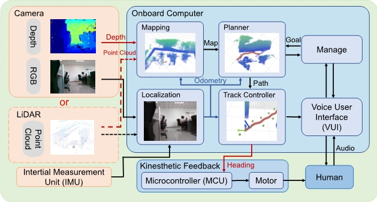
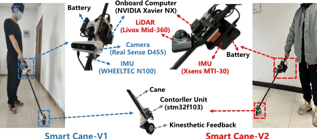

# CanePlanner

This repository contains the source code of the impact-aware planning and control algorithms described in our paper "Improving Walking Path Generation through Biped Constraint in Indoor Navigation System for Visually Impaired Individuals." accepted by IEEE Transactions on Neural Systems & Rehabilitation Engineering (TNRSE), 2024.



The software framework of the Smart Cane is designed as a comprehensive system solution for blind navigation, incorporating perception, localization, planning, and control functions. All these functions are implemented on the microcomputer of the Smart Cane, providing a compact and efficient solution. 

## 1. quick start

The project has been tested on Ubuntu 18.04(ROS Melodic) and 20.04(ROS Neotic). Take Ubuntu 20.04 as an example, run the following commands to setup:

```ssh
    mkdir cane_ws/src
    cd cane_ws/src
    git clone https://github.com/2B-peopletcane_planner.git
    cd ..
    catkin_make
```

After compilation you can start the simulation by:

```ssh
    source devel/setup.bash && roslaunch plan_manage sim_kinplan.launch 
```

You will find the random map and the drone in Rviz. You can select goals for the drone to reach using the `2D Nav Goal` and `2D Pose Estimate` tool. 


## 2. Algorithms 

The project contains Enhancing Indoor Navigation for Visually
Impaired Individuals with Secure Path Generation:

* Safe walking path Generation
* esdf mapping
* plvins supported
* realtime perception planning strategy

## 3.detail

### hardware

Two configurations of the Smart Cane have been designed, utilizing the following hardware components, with a combined weight of 1.5kg.Next Figure  illustrates the distinct subsystems of both Smart Cane versions (V1 and V2), showcasing the arrangement and interconnection of sensors, high-level navigation unit, low-level control unit, and  battery.



