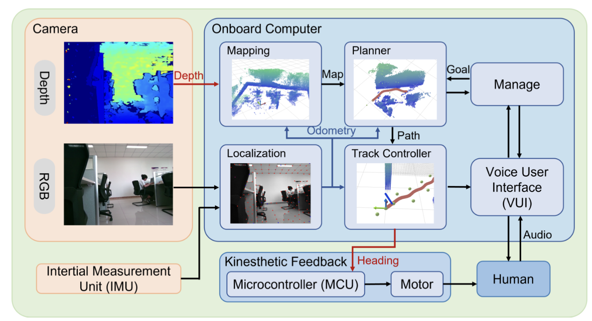
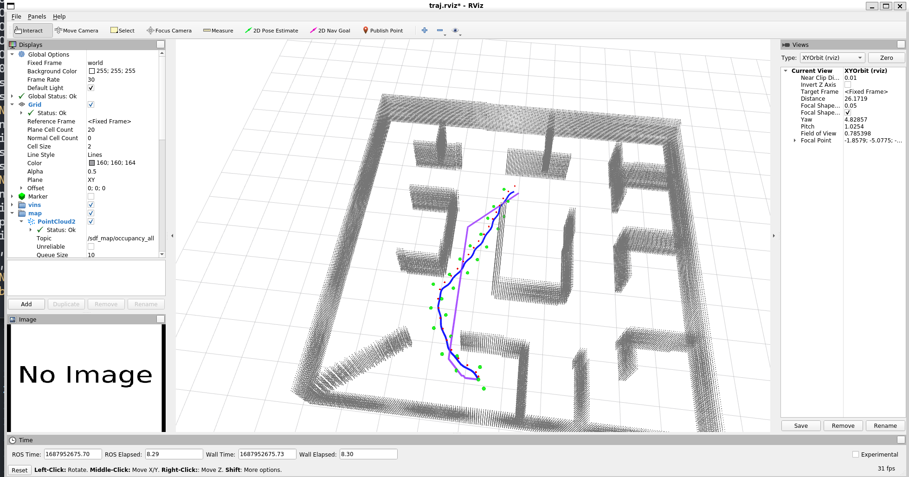

# CanePlanner

The software framework of the Secure Path Guiding Cane(SPGC) is designed as a comprehensive system solution for blind navigation, incorporating perception, localization, planning, and control functions. All these functions are implemented on the microcomputer of the SPGC, providing a compact and efficient solution. To ensure safe navigation in complex environments, we have developed an end-to-end framework that integrates complete perception, localization, planning, and control functionalities.



## 1. quick start

The project has been tested on Ubuntu 18.04(ROS Melodic) and 20.04(ROS Neotic). Take Ubuntu 20.04 as an example, run the following commands to setup:

```ssh
    mkdir cane_ws/src
    cd cane_ws/src
    git clone https://github.com/2B-people/cane_planner.git
    cd ..
    catkin_make
```

After compilation you can start the simulation by:

```ssh
    source devel/setup.bash && roslaunch plan_manage sim_kinplan.launch 
```

You will find the random map and the drone in Rviz. You can select goals for the drone to reach using the `2D Nav Goal` and `2D Pose Estimate` tool. 



## 2. Algorithms 

The project contains Enhancing Indoor Navigation for Visually
Impaired Individuals with Secure Path Generation:

* Safe walking path Generation
* esdf mapping
* plvins supported
* realtime perception planning strategy

## 3.detail

TODO

