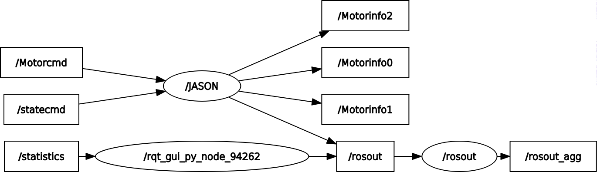

# MotorRevo X3 ROS PACKAGE
## INSTALL

1. Put revoMotor into {your workspace}/src
2. >catkin build revoMotor

## INFORMATION
### 1].MSG TYPE

#### 1).motorcmd.msg
   >float32 position0  
    float32 velocity0  
    float32 torque0  
    float32 kp0  
    float32 kd0  
    float32 position1  
    float32 velocity1  
    float32 torque1  
    float32 kp1  
    float32 kd1  
    float32 position2  
    float32 velocity2  
    float32 torque2  
    float32 kp2  
    float32 kd2   

#### 2).statecmd.msg
>bool stateall

#### 3).motorinfo.msg
>   uint8 CanID  
    float32 position  
    float32 velocity  
    float32 torque  
    uint8 error 

### 2].node figure

## TEST
1. Three motor change into motor mode
    >roscore  
    rosrun revoMotor revodriver_node  
    rostopic -r 10 /statecmd rostopic pub /statecmd revoMotor/statecmd "stateall: true" 
2. Three motor move to 3.14rad
   >roscore  
    rosrun revoMotor revodriver_node  
    rostopic -r 10 /statecmd rostopic pub /statecmd revoMotor/statecmd "stateall: true" 
    rostopic pub /Motorcmd revoMotor/motorcmd "{position0: 3.14, velocity0: 0.0, torque0: 0.0, kp0: 10.0, kd0: 5.0, position1: 3.14,velocity1: 0.0, torque1: 0.0, kp1: 10.0, kd1: 5.0, position2: 3.14, velocity2: 0.0,torque2: 0.0, kp2: 10.0, kd2: 5.0}"

